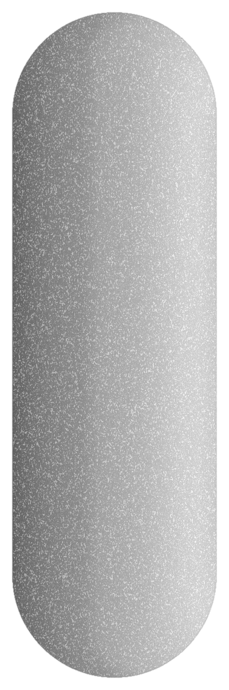

# ProbableUSB v1.0.0 (            )
My colour codes for labeling USB-C specs - basically resistance but for blank-ahh USB-C-to-USB-C cables

# Specifications
Similarly to resistance, the bands are colour-coded and are read left-to-right.

## Coloured Bands
### Band 1 - Power Delivery
| | Colour | Description       |
|-|-------|-------------------|
|  | Black  | ≤ 5W              |
|  | Brown  | 12W (5V x 2.4A)   |
|  | Red    | 18W               |
|  | Orange | 27W               |
|  | Yellow | 45W               |
|  | Green  | 60W               |
|  | Blue   | 100W              |
|  | Violet | 140W (PD 3.1 EDR) |

### Band 2 - Data Rate
| | Colour | Description               |
|-|-------|---------------------------|
|  | Black  | USB 2.0 (480Mb/s)         |
|  | Brown  | USB 3.0/3.1 Gen 1 (5Gb/s) |
|  | Red    | USB 3.1 Gen 2 (10Gb/s)    |
|  | Orange | USB 3.2 Gen 2x2 (20Gb/s)  |
|  | Yellow | USB 4 (20Gb/s)            |
|  | Green  | USB 4 (40Gb/s)            |
|  | Blue   | Thunderbolt 3/4 (40Gb/s)  |

### Band 3 - Features
| | Colour | Description          |
|-|-------|----------------------|
|  | Black or No Band  | No extra features    |
|  | Silver | Shielded |
|  | Gold   | DisplayPort Alt-Mode |

### Band 4 - Quality & Certifications
| | Colour | Description         |
|-|-------|---------------------|
|  | Black or No Band  | None or Unknown     |
|  | Silver | Passive Cable       |
|  | Gold   | Thunderbolt support |
|  | Ruby   | USB-IF certified    |

## Band Requirements
Both bands one and two are required to be labeled

# Examples
Below, are some examples of band combinations and their meanings.

## 1. Common Cables
- 1a. Cheap charging cable (≤ 5W, USB 2.0) 
 
- 1b. Older Phone Chargers (18W, USB 2.0) 
 
- 1c. Fast charging (60W, USB 2.0) 
 
- 1d. Laptop charging cable (100W, USB 2.0) 
 

# 2. Monitor / Docking Cables
- 2a. 60W, USB 4 (40Gb/s), DisplayPort Alt-Mode 
  
- 2b. 45W, USB4 (40 Gb/s), DisplayPort Alt-Mode 
  
- 2c. 100W, USB 3.1 (10 Gb/s), DisplayPort Alt-Mode 
  

# 3. Power-Delivery Only and Speciality Cables
- 3a. 100W power-only cable 
 
- 3b. 140W PD 3.1 EPR power cable 
 
- 3c. 60W charging cable, shielded build 
  
